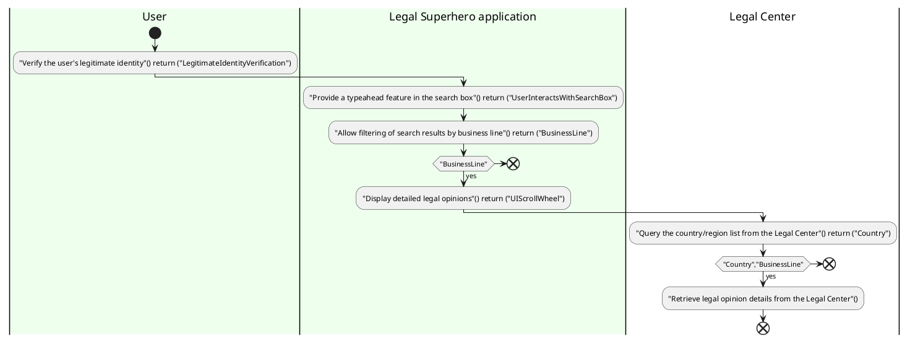

```plantuml
@startuml
|#eeffee|User|
start
:"Verify the user's legitimate identity"() return ("LegitimateIdentityVerification");
|#eeffee|Legal Superhero application|
:"Provide a typeahead feature in the search box"() return ("UserInteractsWithSearchBox");
|#eeffee|Legal Superhero application|
:"Allow filtering of search results by business line"() return ("BusinessLine");
|#eeffee|Legal Superhero application|
if ("BusinessLine") then (yes)
:"Display detailed legal opinions"() return ("UIScrollWheel");
else
end
endif
|Legal Center|
:"Query the country/region list from the Legal Center"() return ("Country");
|Legal Center|
if ("Country","BusinessLine") then (yes)
:"Retrieve legal opinion details from the Legal Center"();
else
end
endif
end
@enduml
```
